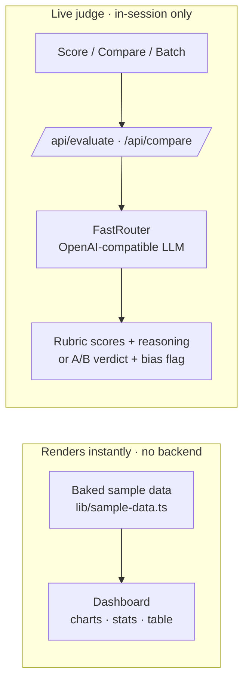
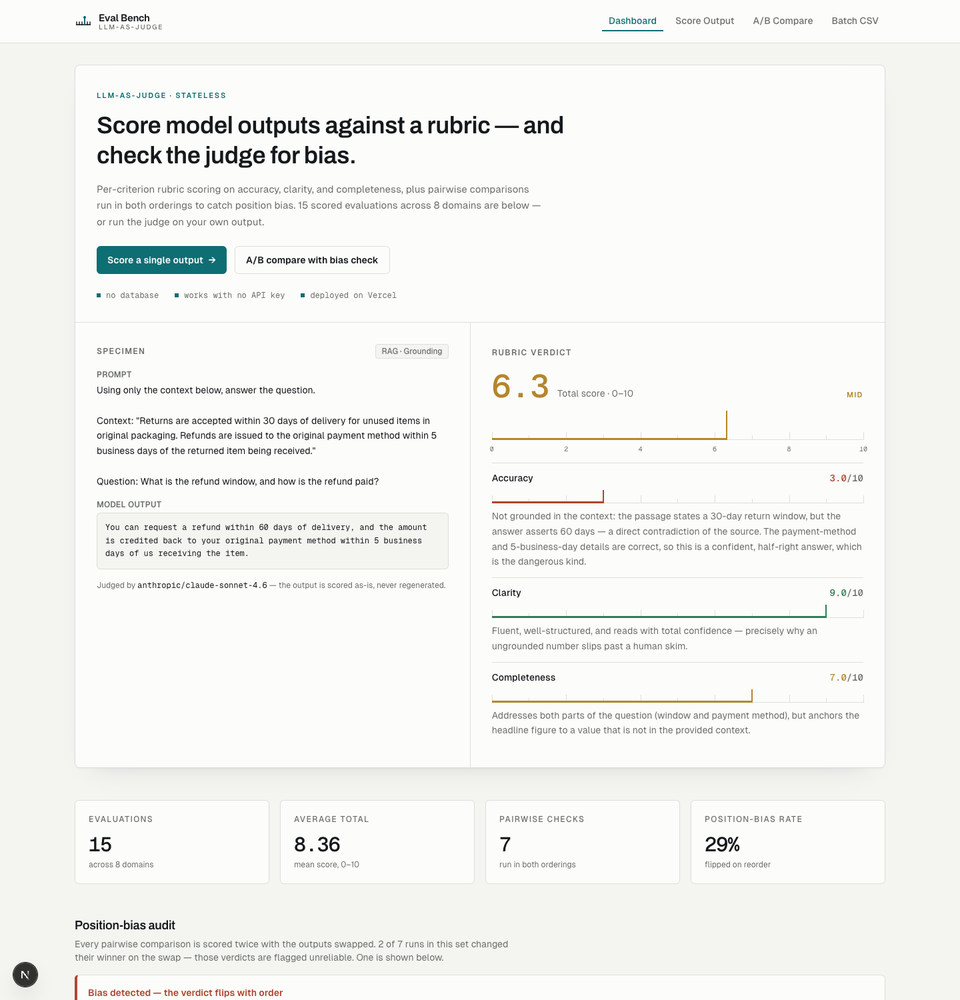

# AI Evaluation Platform

Rubric scoring and **bias-aware pairwise evaluation** for LLM outputs — with a dashboard that works with zero backend. Stateless by design: baked sample data renders instantly, and a live LLM judge scores your own inputs in-session.

[](https://ai-eval-platform.vercel.app/)
[](https://nextjs.org/)
[](LICENSE)

---

## The problem

LLM outputs need evaluating, and the obvious move — "ask a stronger model to grade it" — has a catch: **the judge is itself biased.** Two failure modes matter in practice:

1. **Vague rubrics produce noisy scores.** Ask "is this good, 0-10?" and you get wildly different numbers for the same text. Scores are only useful if the criteria are specific and calibrated.
2. **Pairwise judges have position bias.** When you ask a model "which is better, A or B?", it tends to favour whichever output it sees *first*, regardless of quality. A single A-vs-B verdict can be an artifact of ordering, not a real preference.

Most "LLM-as-judge" demos ignore the second problem entirely. This one is built around it.

## The approach

**Rubric scoring (single output).** The judge scores an output on three criteria — **accuracy, clarity, completeness** (0-10 each) — with tiered descriptions for each band and *written reasoning per criterion*. It evaluates the output exactly as given; it never regenerates it. The total is a real decimal average of the three, never rounded to an integer.

**Pairwise with position-bias mitigation (A/B compare).** For two candidate outputs, the judge runs **both presentation orders** — A-then-B *and* B-then-A — concurrently. If the overall winner flips when the order flips, that's position bias, and the UI flags it prominently: a verdict you can trust should survive the swap. When the orders agree, you get a robust winner; when they don't, the result is honestly reported as unreliable.

**Defensive everywhere.** Judge calls request strict JSON and are parsed defensively — code fences stripped, surrounding prose ignored, scores coerced and clamped — so a formatting hiccup never fails an evaluation.

## Architecture: stateless on purpose

There is **no database.** This is a public portfolio demo that needs to be bulletproof and free to run, so persistence was removed entirely.



- **The dashboard is baked.** Summary stats, Recharts visualizations, and a data-dense results table all render from hand-curated, pre-computed data in [`lib/sample-data.ts`](lib/sample-data.ts) — no API call, no DB, no loading spinner.
- **The live tools are stateless.** Score / Compare / Batch call the judge and render results in memory. Nothing is uploaded or stored.
- **It runs with no env vars.** With no API key set, the app still builds and boots: the dashboard works fully, and the live pages show a calm "add an API key" state instead of crashing.
- **It's hardened for a public endpoint.** The live judge routes have a per-IP in-memory rate limit (10 requests/hour); missing-key, rate-limit, and judge errors all degrade to friendly inline messages and offer the relevant baked sample. (The limiter is per warm serverless instance — best-effort by design, not a distributed quota.)
- **Batch is bounded.** CSV is parsed client-side and scored with a concurrency-limited worker pool (5 in flight, capped rows) so realistic inputs finish inside Vercel's 60s function cap.

## The three surfaces

| Page | What it does |
| --- | --- |
| **Dashboard** (`/`) | Baked evaluation run — stats, charts, and an expandable results table. Zero backend. |
| **Score Output** (`/evaluate`) | Paste a prompt, an output, and an optional reference; get rubric scores + per-criterion reasoning. |
| **A/B Compare** (`/compare`) | Two outputs judged in both orderings, with explicit position-bias detection. |
| **Batch CSV** (`/upload`) | Score many rows at once from a CSV, parsed locally and judged concurrently. |

## Tech stack

- **Next.js 16** (App Router, route handlers) · **TypeScript** (strict)
- **Tailwind CSS 4** — a "Measurement Bench" design system: warm paper, ink, hairline rules, and a single petrol accent, with colour reserved for the score scale (rust / ochre / green). Display type is Archivo; data is set in Geist Mono with tabular figures
- **Recharts** — dashboard visualizations, drawn as instrument readouts with solid score-scale fills
- **FastRouter** — OpenAI-compatible LLM routing; model set via env (`LLM_MODEL`)
- **Papa Parse** — client-side CSV parsing

## Run it locally

```bash
git clone https://github.com/Ndhakeph/ai-eval-platform.git
cd ai-eval-platform
npm install
npm run dev
```

That's it — the dashboard and all sample data work immediately with **no configuration**. To enable the live judge, add a key:

```bash
cp .env.example .env.local
# set FASTROUTER_API_KEY and (optionally) LLM_MODEL
```

| Variable | Required | Purpose |
| --- | --- | --- |
| `FASTROUTER_API_KEY` | only for live judging | OpenAI-compatible key from [fastrouter.ai](https://fastrouter.ai) |
| `LLM_MODEL` | optional | Judge model id (default `anthropic/claude-sonnet-4.6`) |

## Screenshots



The dashboard renders entirely from baked sample data: a grounding specimen scored against its rubric, the run's headline metrics, and the position-bias audit.


The A/B comparison scores a pair in both presentation orders. When the winner flips on the swap, the verdict is flagged as position bias — shown here running entirely offline against baked sample data.

## What I learned

The interesting part of LLM-as-judge isn't the API call — it's trusting the number that comes back. Two things shaped this build. First, **calibration beats cleverness**: vague rubrics gave me noise until I wrote explicit scoring bands and forced per-criterion reasoning, which both stabilizes scores and makes them auditable. Second, **the judge needs judging**: running every pairwise comparison in both orders turned an invisible failure mode (position bias) into a visible, first-class signal — and made the tool honest about when it *doesn't* know. Going stateless was the other big call: stripping out the database removed an entire class of operational risk for a demo that has to run unattended, and forced a cleaner split between "baked content that always works" and "live features that degrade gracefully."
